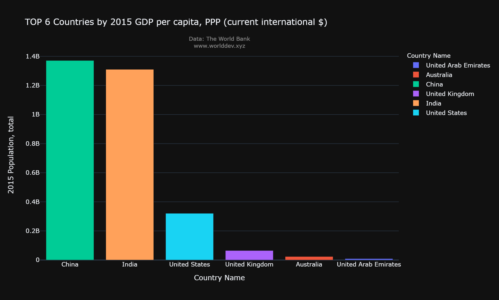

# Factors which play a vital role in countries GDP.

# Topics&Indicators:
- Science& Technology
- Infrastructure
- GDP per capita, PPP (current international $)
- Investment in telecoms with private participation (current US$)
- Research and development expenditure (% of GDP)

# Countries:
- India
- China
- United States
- United Kingdom
- United Arab Emirates

# Introduction:
- GDP(Gross Domestic Product) represents the total monetary value of a country in a period of time. A country’s growth is usually calculated by this factor. Higher the GDP, the higher the National Income. In this rapidly growing world, Technology is something that is playing an important role in representing countries.
**GDP Per Capita of different countries:**
- GDP Per Capita is a measurement of the GDP per person in a country’s population. It indicates that the amount of output or income per person in an economy can indicate average productivity or average living standards. 

- The above Pi chart shows us the GDP of different countries in the year 2015 with United Arab Emirates having the highest GDP of 28.3% and India the lowest with 2.39%.

- But when we compare the population of these countries China is leading the table whereas the United Arab Emirates is the lowest. This shows us that population also plays a key factor in the growth of GDP.
- This shows us that a country should work according to the population in order to maintain its GDP at the top. The above graph shows that China despite being the most populated country its GDP is quite manageable when compared to other countries.

# Effect of  Science& Technology on GDP:

As mentioned earlier GDP is calculated with the countries economy. This means if any country spends on the development of the technology it would rather develop the GDP as well.

